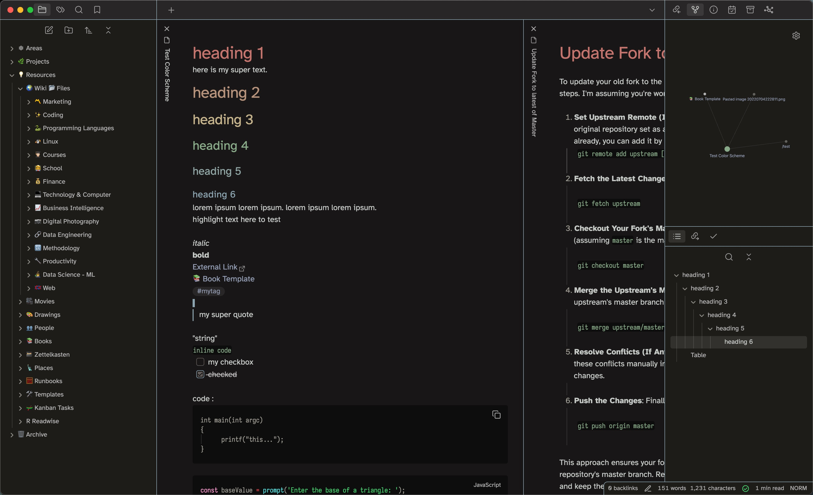
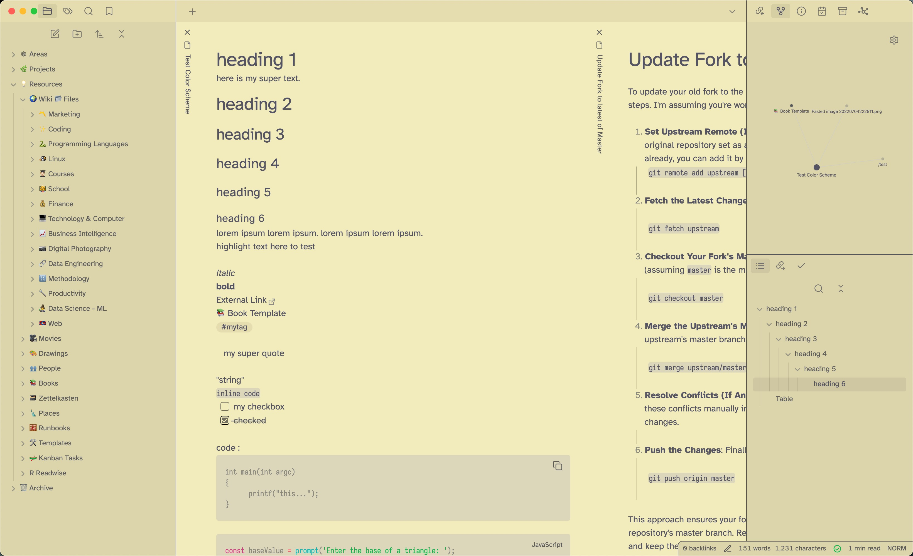

# Kanagawa Paper (Obsidian Theme)
This is a [Kanagawa Paper](https://github.com/sho-87/kanagawa-paper.nvim) theme for [Obsidian](https://obsidian.md/). It supports dark and light mode.

Installation: Simply search `Kanagawa Paper` in the Obsidian Communitiy Themes and Install. Or if manually, copy the `obsidian.css` file to your vault directory and reload Obsidian for it to take effect.

## Dark Mode


## Light Mode 
(not really optimized, mainly did it for the dark mode)



### Bump Version

```sh
npm run version
```


---

*Check also my other Theme I created, [Obsidian Kanagawa](https://github.com/sspaeti/obsidian_kanagawa/), [Obsidian Rosé Pine](https://github.com/sspaeti/obsidian_rose_pine/).*
